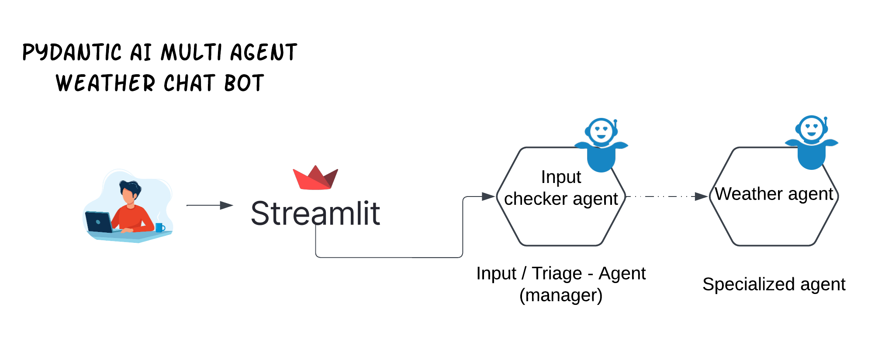
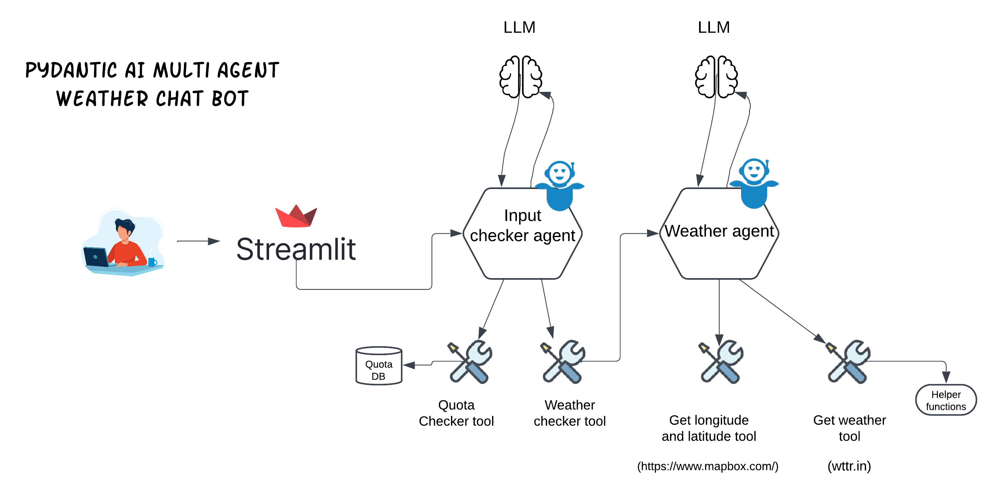
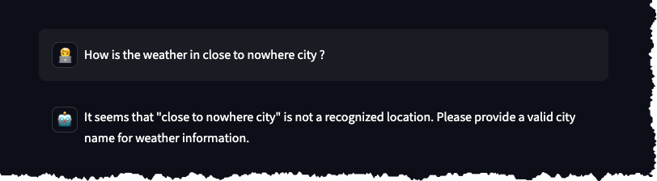

# Pydantic AI - Multi agent weather Chatbot

---

## Highlights

- Multi-agent chatbot using the Pydantic AI framework
- Input checker agent validates user input ( it is triage agent / manager)
- Input checker also checks for Quota (only certain amount of request are allowed every day )
- One agent calls other agent via Tools. Input checkers dependency (deep) has weather agent as a dependency
- Weather agent fetches weather information from an external API ( wttr.in)
- Weather agent also gets latitude and longitude of the location from ( mapbox.com)
- Pydantic AI in this project is using Open AI GPT-4o-mini model
- Streamlit is used for the front end - It provides a Chatbot interface as well it renders output nicely 
- Streamlit uses Plotly for rendering the MAP and line charts 



## Description

This is a multi-agent chatbot that can provide weather information for a given location.
The chatbot is implemented using the Pydantic AI framework.
The chatbot consists of two agents: a weather agent and a input checker agent.
The weather agent is responsible for fetching weather information from an external API,
while the input checker agent is responsible for validating the user input. Only if the request is related 
to weather information, the weather agent is activated. Otherwise, the input checker agent will respond with a helpfull 
message stating that the request is not related to weather information.

## Demo 

- Demo shows user asking non whether related question
- As well asking Question about whether in San Jose and then Question about London 


## Agents in detail 



### Input Checker Agent

The input checker agent is responsible for validating the user input.
First thing it checks is Quota - only certain amount of request are allowed every day.
If the quota is not exceeded, it checks if the user input is related to weather information.
It checks if the user input is related to weather information. If it is, it activates the weather agent.
The way it calls the weather agent is via Tools. Input checkers dependency (deep) has weather agent as a dependency

Input checker is expected to generate below pydantic model as response 

```python
class AgentResult(BaseModel):
    weather_data: Optional[WeatherData] = Field(None, description="Weather data")
    non_weather_related_message: Optional[str] = Field(None, description="Generated in event of non-weather related input")
```

### Weather Agent

The weather agent is responsible for fetching weather information from an external API.
It fetches the weather information from the wttr.in API and also gets the latitude and longitude of the location from mapbox.com.

Weather agent has access to two tools `getweather` and `get_lat_lng`

Input checker is expected to generate below pydantic model as response 

```python
class HourlyForecast(BaseModel):
    time: str  # Formatted time (e.g., "12:00 PM")
    temperature: float  # Temperature in the chosen unit
    description: str  # Weather description
    emoji: str  # Emoji representing the weather kind

class DailyForecast(BaseModel):
    date: str  # Formatted date (e.g., "Monday, December 11, 2024")
    average_temperature: float  # Average temperature for the day
    hourly_forecasts: List[HourlyForecast]  # List of hourly forecasts


class WeatherData(BaseModel):
    city: str = Field(..., description="City for which the weather data is retrieved")
    current_temperature: float = Field(..., description="Current temperature in the chosen unit")
    temp_unit: str = Field(..., description="Temperature unit (C or F)")
    latitude: Optional[float] = Field(None, description="Latitude of the city")
    longitude: Optional[float] = Field(None, description="Longitude of the city")
    forecasts: List[DailyForecast] = Field(..., description="List of daily forecasts")
    country: Optional[str] = Field(None, description="Country of the city")
    region: Optional[str] = Field(None, description="Region of the city")
    unknown_city: Optional[bool] = Field(None, description="True if the city is unknown")
    reason: Optional[str] = Field(None, description="Reason for the unknown city")
    country_emoji: Optional[str] = Field(None, description="Emoji representing the country's flag")
    summary_of_next_x_days: Optional[str] = Field(None, description="Summery of next x days weather")
```

Tool (method) `getweather` needs few input that LLM are supposed to populate using it's world knowledge 
`temperature_unit_celsius_or_fahrenheit` , `country_name` and enve `city_name` it needs to populate if user had made 
typo in city name or city is unknown

If you look at the code `getweather` tool populate almost all fields in WeatherData model but 
it then expects LLM to summarize the weather for next x days in filed 'summary_of_next_x_days'
at same time `country_emoji` is also supposed to be populated by LLM. 

If user ask for City that is non-existent then `unknown_city` is set to True and `reason` is set to reason why city is unknown




```shell
22:49:02.440 input_checker_agent run prompt=oKAY , Do I need rain jacket in London ? 
22:49:02.442   preparing model and tools run_step=1
22:49:02.443   model request
INFO:httpx:HTTP Request: POST https://api.openai.com/v1/chat/completions "HTTP/1.1 200 OK"
INFO:weather_agent:[Tool quota_checker] Thoughts: The user is asking about the necessity of a rain jacket in London, which pertains to current weather conditions.
22:49:03.559   handle model response
22:49:03.560     running tools=['quota_checker']
INFO:weather_agent:CSV file exists
INFO:weather_agent:Quota not reached. Count: 32
22:49:03.573   preparing model and tools run_step=2
22:49:03.574   model request
INFO:httpx:HTTP Request: POST https://api.openai.com/v1/chat/completions "HTTP/1.1 200 OK"
22:49:04.717   handle model response
22:49:04.718     running tools=['check_weather']
[Tool check_weather] Thoughts [User needs to know if they need a rain jacket in London, which requires current weather data.] and User Input [Do I need rain jacket in London?]
22:49:04.722     weather_agent run prompt=Do I need rain jacket in London?
22:49:04.726       preparing model and tools run_step=1
22:49:04.727       model request
INFO:httpx:HTTP Request: POST https://api.openai.com/v1/chat/completions "HTTP/1.1 200 OK"
INFO:weather_agent:[Tool quota_checker] Thoughts: User asked about weather in London, need to check the current weather to see if rain is expected.
INFO:weather_agent:Getting lat and lng for London and Country GB
INFO:weather_agent:Getting lat and lng for London and Country GB
22:49:06.245       handle model response
22:49:06.246         running tools=['get_lat_lng']
INFO:weather_agent:Latitude: 51.5073, Longitude: -0.127647
22:49:06.415       preparing model and tools run_step=2
22:49:06.418       model request
INFO:httpx:HTTP Request: POST https://api.openai.com/v1/chat/completions "HTTP/1.1 200 OK"
INFO:weather_agent:[Tool : getweather ] Thoughts: Checking the weather for rain in London to answer the users question about needing a rain jacket.
INFO:weather_agent:Temperature unit: Celsius
22:49:07.914       handle model response
22:49:07.915         running tools=['getweather']
22:49:08.838       preparing model and tools run_step=3
22:49:08.840       model request
INFO:httpx:HTTP Request: POST https://api.openai.com/v1/chat/completions "HTTP/1.1 200 OK"
22:49:20.280       handle model response
22:49:20.296   preparing model and tools run_step=3
22:49:20.297   model request
INFO:httpx:HTTP Request: POST https://api.openai.com/v1/chat/completions "HTTP/1.1 200 OK"
INFO:__main__:Time taken to fetch weather data: 29.16667103767395
22:49:31.551   handle model response
Total cost for e05f344e-e5cf-46d1-a95c-17ce7f13560b: $0.00092235
```