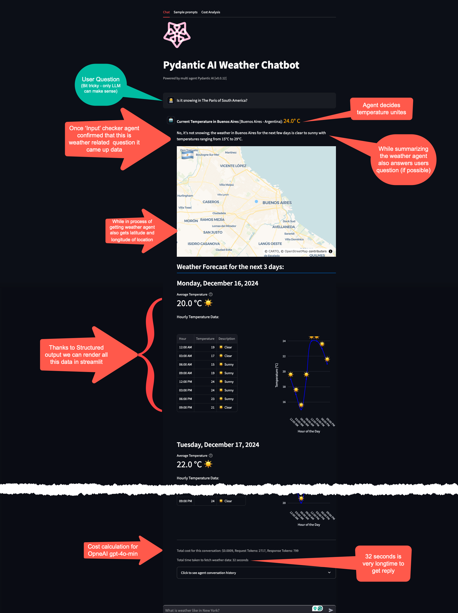
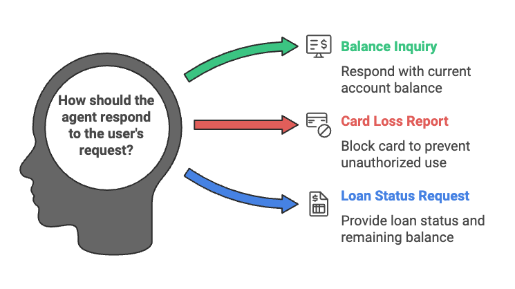
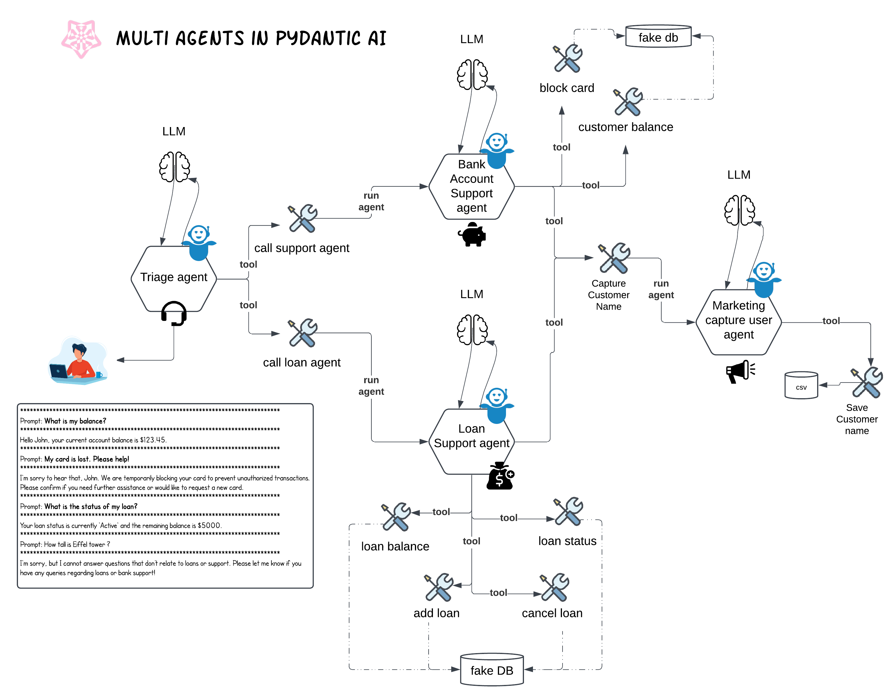

# Multi-Agent System in Pydantic AI



## Overview

This system utilizes Pydantic AI to simulate multiple agents working together to handle different types of customer queries. The agents are specifically designed for handling customer support, loan inquiries, and triaging queries between the support and loan departments. Below is an explanation of how the agents interact with each other and the flow of data between them.

## What Chatbot can do 



## Flow Diagram

The following diagram shows the flow of data and interactions between agents in the system:



## TL;DR

This code is an extension of sample given at https://ai.pydantic.dev/examples/bank-support/ 
The new things I have added in this is multi-agent system - like triage agent, loan agent, support agent and marketing agent.
Triage can call support agent or loan agent based on the query.
Support agent and loan agent can call marketing agent to save customer name.

They way agents are called is via Tools. Each agent has its own dependencies and they are passed to the agent via RunContext.
See the code below for more details.

In this case methods/tools `call_support_agent` and `call_loan_agent` are called by triage agent based on the query.
```python
@triage_agent.tool
async def call_support_agent(ctx: RunContext[TriageDependencies], prompt: str) -> RunResult[Any]:
    # print(f"Calling support agent with prompt: {prompt}")
    support_deps = SupportDependencies(customer_id=ctx.deps.customer_id, db=DatabaseConn(), marketing_agent=marketing_agent)

    return await ctx.deps.support_agent.run(prompt, deps=support_deps)

@triage_agent.tool
async def call_loan_agent(ctx: RunContext[TriageDependencies], prompt: str) -> RunResult[Any]:
    # print(f"Calling loan agent with prompt: {prompt}")
    loan_deps = LoanDependencies(customer_id=ctx.deps.customer_id, db=LoanDB(), marketing_agent=marketing_agent)

    return await ctx.deps.loan_agent.run(prompt, deps=loan_deps)
```

## Agents in the System

### 1. **Support Agent**
The Support Agent is responsible for handling customer support queries. These include inquiries related to customer balance, card blocking, and other general account-related issues.

**Responsibilities:**
- Block a customer's card if needed.
- Provide the customer's balance details.
- Assess the risk level of the query.
- Capture the customer's name using the `capture_customer_name` tool.

**Example Query:**
- "What is my balance?"
- "I just lost my card!"

**System Prompt:**
```
You are a support agent in our bank, give the customer support and judge the risk level of their query. 
Reply using the customer's name.
Additionally, always capture the customer’s name in our marking system using the tool `capture_customer_name`, regardless of the query type.
At the end of your response, make sure to capture the customer’s name to maintain proper records.
```

### 2. **Loan Agent**
The Loan Agent deals with all customer queries related to loan status, balance, loan addition, and cancellations. 

**Responsibilities:**
- Provide the loan approval status.
- Fetch the loan balance.
- Handle loan cancellations and additions.

**Example Query:**
- "What is the status of my loan?"
- "Can I add a loan?"

**System Prompt:**
```
You are a support agent in our bank, assisting customers with loan-related inquiries. 
For every query, provide the following information: 
- Loan approval status (e.g., Approved, Denied, Pending)
- Loan balance
Please ensure that your response is clear and helpful for the customer. 
Always conclude by providing the customer’s name and capturing their information in the marking system using the tool `capture_customer_name`. 
Never generate data based on your internal knowledge; always rely on the provided tools to fetch the most accurate and up-to-date information.
```

### 3. **Triage Agent**
The Triage Agent is the central hub that receives customer queries and determines whether the query should be directed to the Support Agent or the Loan Agent.

**Responsibilities:**
- Direct queries to the appropriate department (Support or Loan) based on the content of the query.
- If the query is ambiguous, inform the customer accordingly and suggest the right department.

**System Prompt:**
```
You are a triage agent in our bank, responsible for directing customer queries to the appropriate department.
For each query, determine whether it is related to support (e.g., balance, card, account-related queries) or loan services (e.g., loan status, application, and loan-related inquiries).
If the query is related to support, direct the customer to the support team with an appropriate response.
If the query is related to loans, direct the customer to the loan department with a relevant response.
If the query is unclear or does not fit into either category, politely inform the customer and suggest they ask about loans or support.
Always ensure that the response is clear, concise, and provides direction to the right department for further assistance.
```

### 4. **Marketing Agent**
The Marketing Agent is responsible for saving customer data, such as their name, and tracking how many times their information has been captured.

**Responsibilities:**
- Save the customer's name and track the number of inquiries made.
- Store this data in a CSV file.

**System Prompt:**
```
You are a marketing agent in our bank. 
For now, you only save the customer name in our marking system using tool `save_customer_name`.
```

---

## Flow of Data and Agent Interactions

### 1. **Triage Agent** Receives Query
- When a customer submits a query, it is initially handled by the **Triage Agent**.
- The Triage Agent examines the query to determine if it pertains to a **support** issue (such as balance inquiries or card blocking) or a **loan** issue (such as loan status or application).
- Based on the query, the Triage Agent either directs the customer to the **Support Agent** or **Loan Agent**.

### 2. **Support Agent** or **Loan Agent** Takes Over
- Once the Triage Agent determines the correct department, it either calls the **Support Agent** or the **Loan Agent** using a tool.
- Both agents capture the customer's name through the `capture_customer_name` tool.
- If the query is support-related, the **Support Agent** processes the request, assesses risk, and provides a response.
- If the query is loan-related, the **Loan Agent** processes the request, such as checking loan status, and provides a response.

### 3. **Marketing Agent** Captures Data
- Both the **Support Agent** and **Loan Agent** call the **Marketing Agent**'s `capture_customer_name` tool to store customer information, such as their name and number of inquiries.

---

## Conclusion

This system demonstrates how multiple agents can interact in Pydantic AI to handle customer inquiries in a bank. Each agent is responsible for a specific domain (Support, Loan, Triage), and they work together to direct the customer to the right department while capturing customer data for marketing purposes. The interactions between these agents provide an efficient way to handle customer queries and ensure the customer receives the most relevant information.
